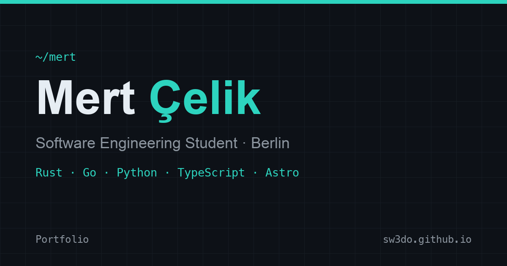

# Mert Çelik — Computer Science Portfolio

Live site: **https://sw3do.github.io**



A personal computer-science portfolio in three parts:

- a **static website** built with Astro (dark/light themes, accessible, SEO-ready),
- a one-page **CV** built with LaTeX, and
- a **project report** (LaTeX, Harvard referencing) describing the design.

## Repository structure

```
sw3do.github.io/
├── src/
│   ├── components/      UI components (Nav, Hero, Projects, …)
│   ├── layouts/         page + article layouts
│   ├── pages/           routes (home, /projects/[slug], /blog, 404)
│   ├── content/         case studies + blog posts (Markdown)
│   ├── data/            profile, skills, projects (typed)
│   └── styles/          design tokens + global CSS
├── public/              CV PDF, OG image, favicon, robots.txt
├── cv/                  LaTeX CV source + Mert-Celik-CV.pdf
├── report/              LaTeX project report
└── .github/workflows/   build + deploy to GitHub Pages
```

## Tech stack

Astro · TypeScript · CSS custom properties · astro-icon (Lucide + Simple Icons) · @fontsource (Space Grotesk, Inter, JetBrains Mono) · @astrojs/sitemap · GitHub Pages + GitHub Actions. CV and report in LaTeX (pdfLaTeX).

## Local development

```bash
npm install
npm run dev        # http://localhost:4321
npm run build      # static build → dist/
npm run preview    # preview the production build
```

## Building the documents

```bash
cd cv     && pdflatex mert-celik-cv.tex && pdflatex mert-celik-cv.tex
cd report && pdflatex report.tex        && pdflatex report.tex
```

## Deployment

Every push to `main` runs `.github/workflows/deploy.yml`, which builds the site and publishes it to GitHub Pages.

## Contact

- Email: sw3doo@gmail.com
- GitHub: [github.com/sw3do](https://github.com/sw3do)
- LinkedIn: [linkedin.com/in/swedo](https://linkedin.com/in/swedo)
